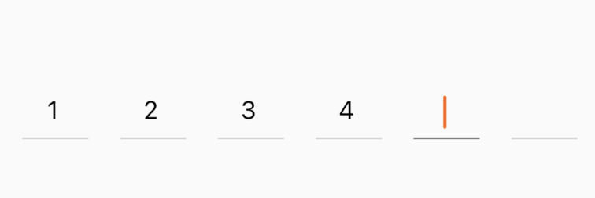

<!--
This README describes the package. If you publish this package to pub.dev,
this README's contents appear on the landing page for your package.

For information about how to write a good package README, see the guide for
[writing package pages](https://dart.dev/guides/libraries/writing-package-pages).

For general information about developing packages, see the Dart guide for
[creating packages](https://dart.dev/guides/libraries/create-library-packages)
and the Flutter guide for
[developing packages and plugins](https://flutter.dev/developing-packages).
-->

A simple pin text box that supports customization of cursor, border, font, etc

## Getting started

read install tab

## Usage

object

```dart
PinTextField PinTextField({
  Key? key,
  int count = 6,
  double height = 42.0,
  double width = 42.0,
  Color cursorColor = const Color.fromRGBO(255, 96, 10, 1),
  Color fontColor = const Color.fromRGBO(0, 0, 0, 1),
  double fontSize = 16,
  double borderWidth = 1.0,
  Color borderColor = const Color.fromRGBO(204, 204, 204, 1),
  double focusBorderWidth = 1.0,
  Color focusBorderColor = const Color.fromRGBO(100, 105, 110, 1),PinTextFieldBorderType borderType = PinTextFieldBorderType.Underline,
  String finishedStringSeparator = "",
  void Function(String)? onFinished,
})
```

usage

```dart
PinTextField(
    borderType: PinTextFieldBorderType.Underline,
    finishedStringSeparator: ",",
    onFinished: (value) {
        print(value);
    })
```


